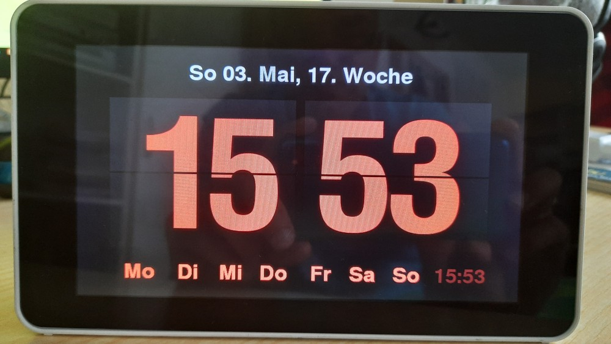

# alarmclock-pi

Alarmclock on a Raspberry Pi with a touch display

## Motivation

I wanted to have a Raspberry Pi based alarm clock that can replace my simple radio clock.
It should
* have a decent time display inspired by flip clocks
* have a touch UI interface allowing to enable/disable the alarm and define the alarm time
* have a configurable alarm sound (mp3 file or stream). This is not necessary via the touch UI
* run on Raspberry Pi model one. I still have some and a simple alarm clock should not need more resources

## Material

* Raspberry Pi
* 7" TFT LCD touch display [RASPBERRY PI 7TD](https://www.reichelt.de/raspberry-pi-shield-display-lcd-touch-7-800x480-pixel-raspberry-pi-7td-p159859.html)
* SD card with [Raspbian](https://www.raspberrypi.org/downloads/raspbian/) buster
* Python 3 with packages [pygame](https://www.pygame.org/), [requests](https://github.com/psf/requests)
* The digit font from [Gluqlo](https://github.com/alexanderk23/gluqlo.git)
* Some [Flaticon](https://www.flaticon.com/) icons made by [Freepik](https://www.flaticon.com/authors/freepik)

## Installation

* system initialization
```
sudo apt-get update && sudo apt-get -y upgrade
```
* adjust locale, timezone, WiFi country, hostname via raspi-config
* configure network, if necessary
* adjust /etc/systemd/timesyncd.conf
* apt-get install -y git
* git clone https://github.com/afischer81/alarmclock-pi.git
* install LCD display driver
```
./install.sh lcd
```
* install further packages (lightdm, python)
```
./install.sh packages
```
* install X session startup file
```
./install.sh xsession
```
* enable boot into graphical desktop with autologin via raspi-config
* create sounds folder and put an alarm sound MP3 file into it

## Usage

### Command line options

```
usage: alarmclock.py [-h] [-a ALARM] [-d] [--iobroker IOBROKER] [-L LOCALE]
                     [-s SOUND]

Raspberry Pi alarm clock

optional arguments:
  -h, --help            show this help message and exit
  -a ALARM, --alarm ALARM
                        alarm time
  -d, --debug           debug execution
  --iobroker IOBROKER   iobroker IP address and port
  -L LOCALE, --locale LOCALE
                        set locale
  -s SOUND, --sound SOUND
                        alarm sound
```

### Regular operation

The clock shows the time, date, current week and the alarm time as shown in the image below.

 running state")

The time numbers and the alarm time are touch UI active (can be clicked).
Clicking the alarm time in the lower right corner switches to alarm time editing display.
The two brightness icons in the lower left can be used to adjust the brightness. 
During the night (22:00 - 7:00) the color of the time display will be dimmed as well from (255,255,255) = white to (96,96,96) = medium gray because even with dimmed display the digit display is too bright for my taste.

### Alarm Editing



The color switches to the alarm color and the upper and lower half of the hour and minute number can be clicked.
Clicking the upper half will increase the corresponding number and clicking the lower half will reduce it.
The active week days for the alarm are shown in the bottom. Each day can be clicked as well and will toggle its status.
The alarm will only be active on selected days (in the image all).
Clicking the alarm time in the lower right corner acknowledges and goes back to the normal state.

### Alarm operation

During an alarm the time display color will change to the highlight color and the alarm sound will be played for the duration specified in alarm_length.
The alarm can be cancelled by clicking the alarm time.

## References

* [PyAlarmClock](https://github.com/rohrej/PyAlarmClock)
* [Gluqlo](https://github.com/alexanderk23/gluqlo.git)
* Icons made by [Freepik](https://www.flaticon.com/authors/freepik) from [Flaticon](https://www.flaticon.com/)
